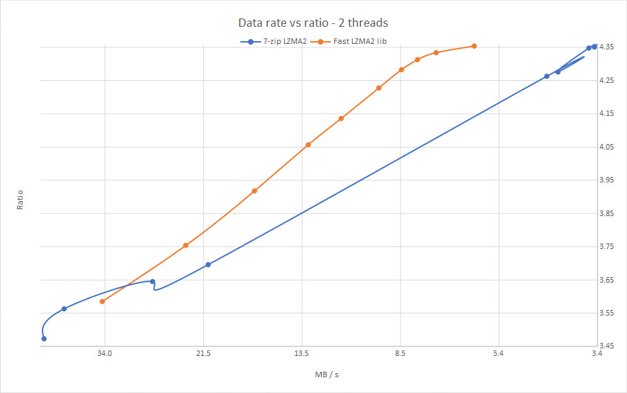

 The __Fast LZMA2 Library__ is a lossless high-ratio data compression library based on the LZMA2 codec in 7-zip.

Binaries of 7-Zip forks which use the algorithm are available in the [7-Zip-FL2 project] and the [7-Zip-zstd project].

[7-Zip-FL2 project]: https://github.com/conor42/7-Zip-FL2/releases/
[7-Zip-zstd project]: https://github.com/mcmilk/7-Zip-zstd/releases/

The library uses a parallel buffered radix match finder and some optimizations from Zstandard to achieve a 20% to 100%
speed gain at the higher levels over the default LZMA2 algorithm used in 7-zip, for a small loss in compression ratio. Speed gains
depend on the nature of the source data. The library also uses some threading, portability, and testing code from Zstandard.

Use of the parallel buffered radix match finder allows multithreaded execution with a simple design and low memory requirement. The
library can compress using many threads without dividing the input into large chunks, and the resulting duplication of the match
finder tables and chains. Extra memory used per thread is typically no more than a few megabytes.

The largest caveat is that the matchfinder is a block algorithm, and to achieve about the same ratio as 7-Zip requires double the
dictionary size, which raises the decompression memory usage. By default it uses the same dictionary size as 7-Zip, resulting in a
small loss of ratio. A high-compression option is provided to select parameters which achieve higher compression on smaller
dictionaries. The speed/ratio tradeoff is less optimal with this enabled.

Tested in memory vs the 7-zip 19.00 LZMA2 encoder on the [Silesia compression corpus] using two threads. The design goal for the
encoder and compression level parameters was to move the line as far as possible toward the top left of the graph. This provides an
optimal speed/ratio tradeoff.

[Silesia compression corpus]: http://sun.aei.polsl.pl/~sdeor/index.php?page=silesia

Compression data rate vs ratio
------------------------------

### Build

Build methods are not yet comprehensive for all systems. There are VS 2015 projects for building a benchmark program, fuzz tester,
and a DLL. Makefiles for gcc are included for the benchmark, fuzzer and DLL, and user nemequ has contributed a CMake file. If anyone
would like to help improve the build methods, please do so.

### Status

The library has passed a large amount of fuzz testing, and testing on file sets selected at random in the Radyx file archiver. An
earlier version was released in the 7-Zip forks linked above. The library is suitable for production environments.

Changes in v1.0.0:

- Redesigned API.
- Moved detection of repeats from the single-threaded initialization stage to a later, multithreaded stage.
- LZMA2 encoder optimizations; some from Igor Pavlov's optimizations in 7-Zip 18.05, and some additional ones.
- Removed two compression levels, reducing the total to 10, and tweaked the parameters.
- Multithreaded decompression.

Changes in v0.9.2:

- Fixed excess memory allocation when the dictionary size is > 64Mb

Changes in v0.9.1:

- Fixed a bug in compression of very small files when using a high search depth.
- Added an incompressibility checker which processes high-entropy (e.g. encrypted or
  already compressed) data about twice as fast as before.

### License

Fast LZMA2 is dual-licensed under [BSD](LICENSE) and [GPLv2](COPYING).
